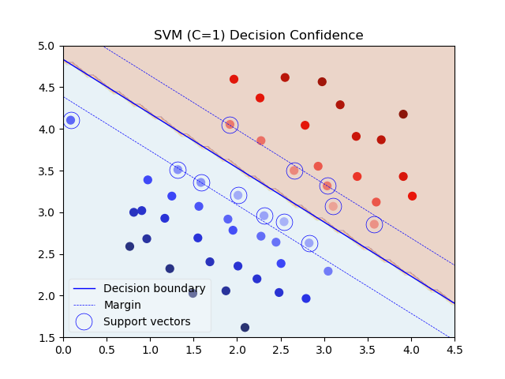
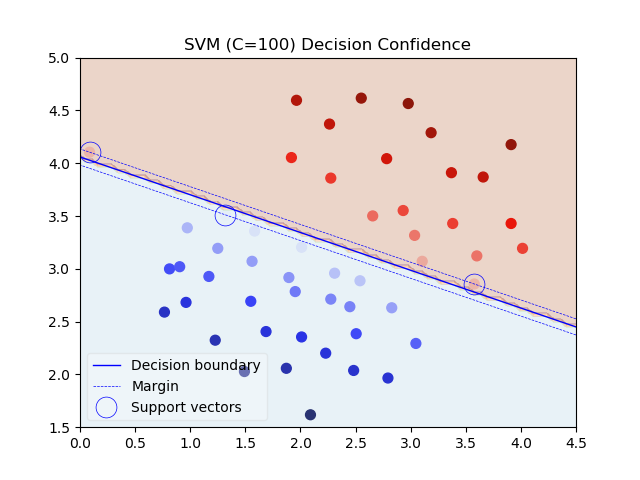
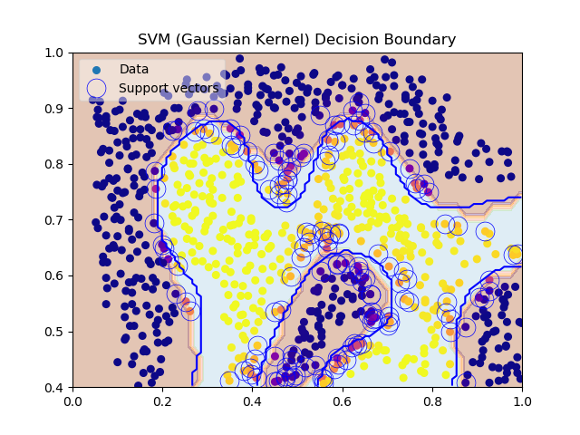
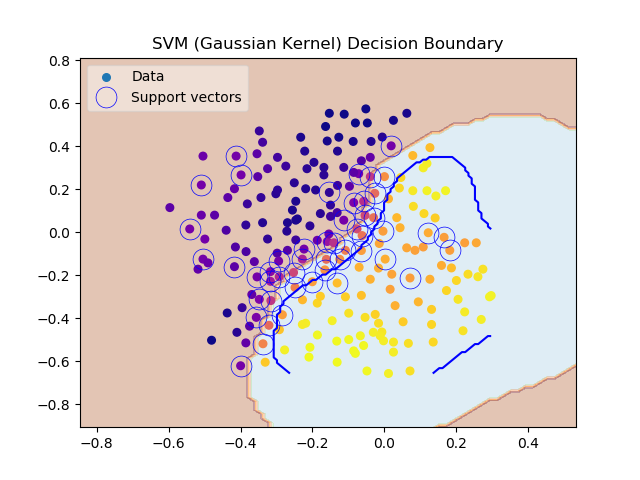

# Support Vector Machine 

# Example Dataset 1

You will see how using different values of the C
parameter with SVMs. Informally, the C parameter is a positive value that
controls the penalty for misclassified training examples. A large C parameter tells the SVM to try to classify all the examples correctly. C plays a role
similar to 1 / λ, where λ is the regularization parameter that we were using
previously for logistic regression.

The next part of code will run the SVM training (with C = 1.
When C = 1, you should find that the SVM puts the decision boundary in
the gap between the two datasets and misclassifies the data point on the far
left (Figure 2).

Your task is to try different values of C on this dataset. Specifically, you
should change the value of C in the script to C = 100 and run the SVM
training again. When C = 100, you should find that the SVM now classifies
every single example correctly, but has a decision boundary that does not
appear to be a natural fit for the data (Figure 3)

## SVM with Gaussian Kernels

In this part of the exercise, you will be using SVMs to do non-linear classification. In particular, you will be using SVMs with Gaussian kernels on
datasets that are not linearly separable.

## Example Dataset 2

## Example Dataset 3

